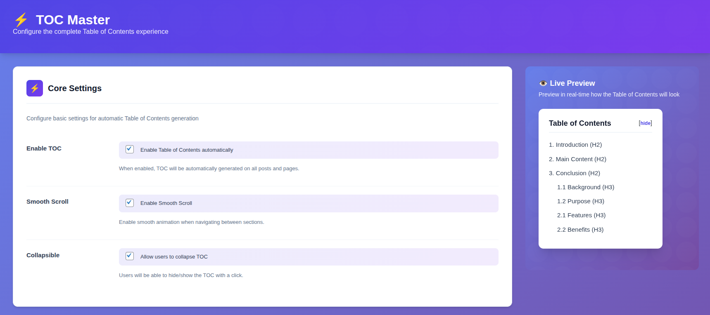

# TOC Builder by RobertIvan ⚡

> An advanced Table of Contents generator plugin for WordPress with smooth scroll, Gutenberg support, and high configurability.

## 📖 Description

**TOC Builder by RobertIvan** is a powerful Table of Contents plugin that automatically generates a navigation menu from your content's headings. Designed for long-form content, documentation sites, and blogs, it enhances user experience by providing easy navigation.

It features a modern, card-based admin interface with a live preview, making configuration intuitive and instant.

## ✨ Core Features

*   **🔍 Auto-Detection**: Automatically scans content for headings (H1-H6).
*   **📜 Smooth Scroll**: Animated scrolling to sections for a polished feel.
*   **🕵️ SpyScroll**: Highlights the current section in the TOC while scrolling.
*   **🧱 Gutenberg Ready**: Includes a native block with live preview in the editor.
*   **⚙️ Highly Configurable**: Customize position, headings to include, and more.
*   **⚡ Performance**: Optimized assets loading (only loads where needed).
*   **📱 Responsive**: Fully compatible with desktop, tablet, and mobile devices.

## 🚀 Admin Interface

TOC Builder by RobertIvan features a modern admin settings page designed for the best user experience:

*   **Live Preview**: See changes instantly as you configure settings.
*   **Interactive Demo**: Test the collapsible functionality right in the admin.
*   **Visual Hierarchy**: Preview the structure based on your selected headings.
*   **Design System**: Built with a modern gradient color scheme and smooth transitions.

## 📦 Installation

### Automatic Installation
1.  Log in to your WordPress admin panel.
2.  Navigate to **Plugins → Add New**.
3.  Search for "TOC Builder by RobertIvan".
4.  Click **Install Now** and then **Activate**.
5.  Navigate to **TOC Builder** in the WordPress sidebar to configure.

### Manual Installation
1.  Download the plugin ZIP file.
2.  Upload the `toc-master` folder to the `/wp-content/plugins/` directory.
3.  Activate the plugin through the **Plugins** menu in WordPress.
4.  Navigate to **TOC Builder** in the WordPress sidebar to configure.

## 🛠️ Usage

Once activated, you can configure the plugin via the **TOC Builder** menu in your WordPress dashboard.

1.  **Enable TOC**: Toggle the automatic insertion.
2.  **Select Headings**: Choose which levels (H1-H6) to include.
3.  **Position**: Decide where the TOC should appear (Before/After first heading, or Top).
4.  **Customize**: Enable Smooth Scroll or Collapsible options.

**Manual Insertion:**
You can also manually place the TOC using:
*   The `[toc]` shortcode anywhere in your content.
*   The **TOC Builder** block in the Gutenberg editor.

## ❓ FAQ

<strong>How does the plugin work?</strong>

TOC Builder by RobertIvan automatically scans your post or page content for HTML heading tags (H1 through H6) and generates a navigational Table of Contents. It adds unique IDs to each heading so users can jump directly to sections.

<strong>Can I exclude specific headings?</strong>

Currently, you can select which heading levels (H1-H6) to include in the settings. For example, you can choose to only include H2 and H3 headings.

<strong>Does it work with page builders?</strong>

Yes. It works with any content that uses standard HTML heading tags (`<h1>` to `<h6>`) and the standard WordPress `the_content` filter. This includes most major page builders.

<strong>Does it affect my site's performance?</strong>

No. The plugin is optimized for performance with minimal CSS and JavaScript that only loads when needed.

## 📋 Changelog

### 1.2.1
*   **Changed**: All functions, classes, and hooks prefixed with `tbrv_` to prevent conflicts.
*   **Changed**: All CSS classes renamed to `.tbrv-*` for consistency.
*   **Improved**: WordPress coding standards compliance with unique prefixes throughout.

### 1.2.0
*   **Added**: WordPress sidebar menu with icon and structure.
*   **Added**: Separate admin pages for General, Appearance, Advanced, and Premium.
*   **Added**: Live preview that regenerates when selecting/deselecting heading levels.
*   **Added**: Heading selectors with clickable areas.
*   **Added**: Visual selection feedback with gradient backgrounds.
*   **Added**: Preview generation showing TOC structure based on heading combinations.
*   **Added**: 2-column layout with settings and sticky preview side-by-side on desktop.
*   **Improved**: Asset loading - JavaScript only loaded on pages that need it.
*   **Improved**: UX with click-anywhere-on-box heading selection.
*   **Fixed**: Tab navigation replaced with WordPress standard submenu pages.

### 1.1.0
*   **Added**: Admin interface with design.
*   **Added**: Tab-based navigation.
*   **Added**: Live preview with interactive demo.
*   **Added**: Card-based settings layout.
*   **Added**: Animations and transitions.
*   **Added**: Responsive admin design.

### 1.0.1
*   **Fixed**: Bug where heading ID injection failed when headings had no existing attributes.
*   **Fixed**: JavaScript and CSS assets not loading properly on frontend.
*   **Fixed**: Variable scope issue causing incorrect heading IDs to be reused.
*   **Improved**: Offset-based string replacement for reliability.

### 1.0.0
*   Initial release.
*   Added auto-detection of headings.
*   Added smooth scroll and SpyScroll.
*   Added Gutenberg block support.

## 🏗️ Technical Details

*   **Structure**: Component-based architecture.
*   **Styling**: Custom CSS properties, modular components.
*   **Colors**:
    *   Primary Gradient: `#4F46E5` → `#7C3AED`
    *   Accent Cyan: `#06B6D4`
    *   Accent Purple: `#A855F7`

## ❤️ Credits

Developed with ❤️ for the WordPress community by [Robert Ivan](https://github.com/robertivan/).

---
*License: GPLv2 or later*
